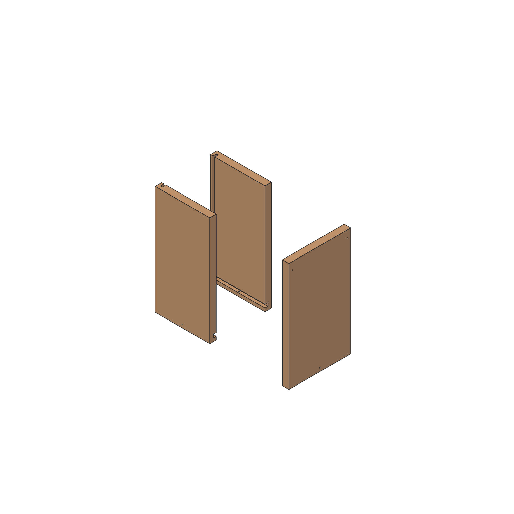
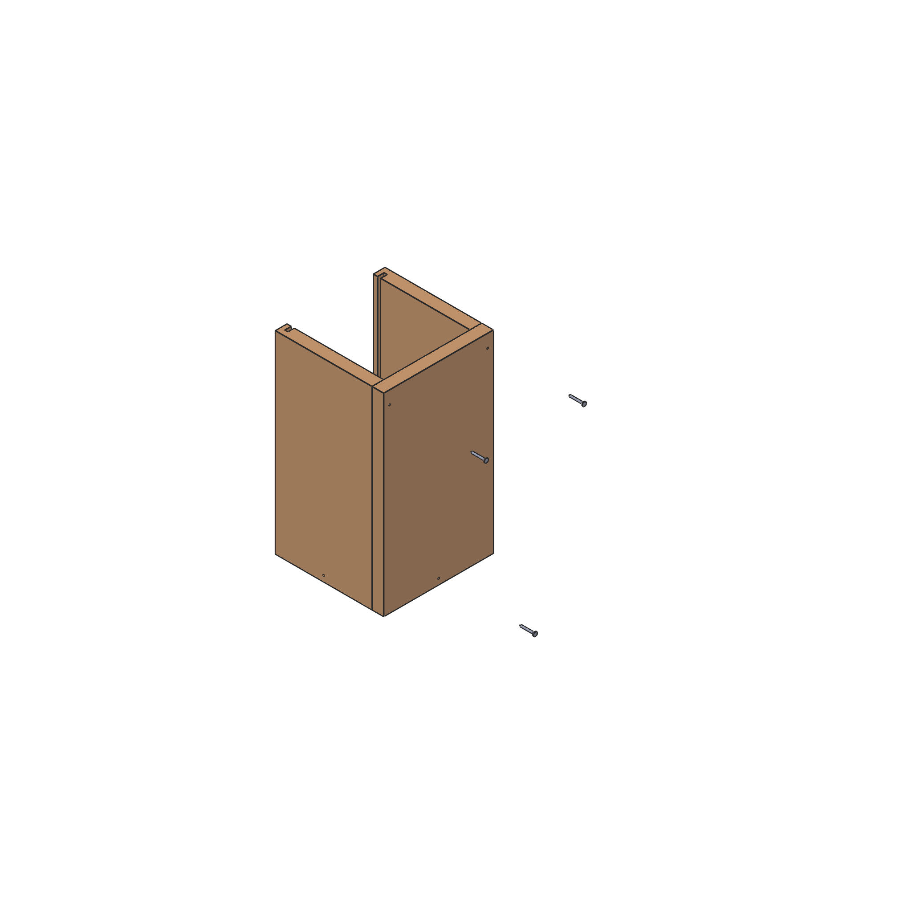
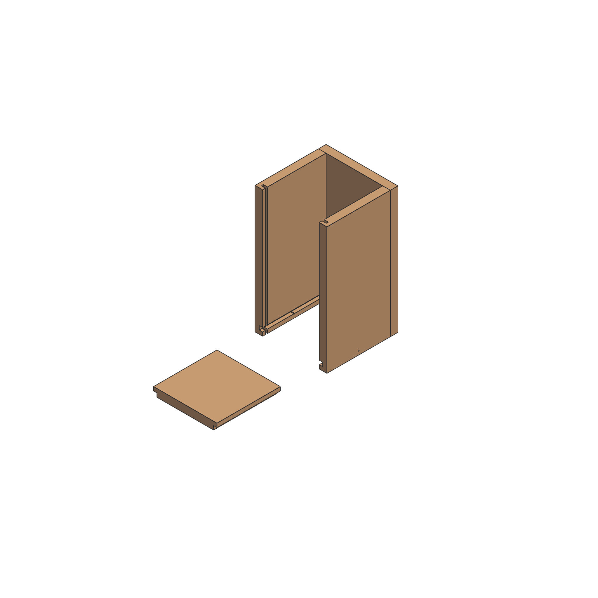
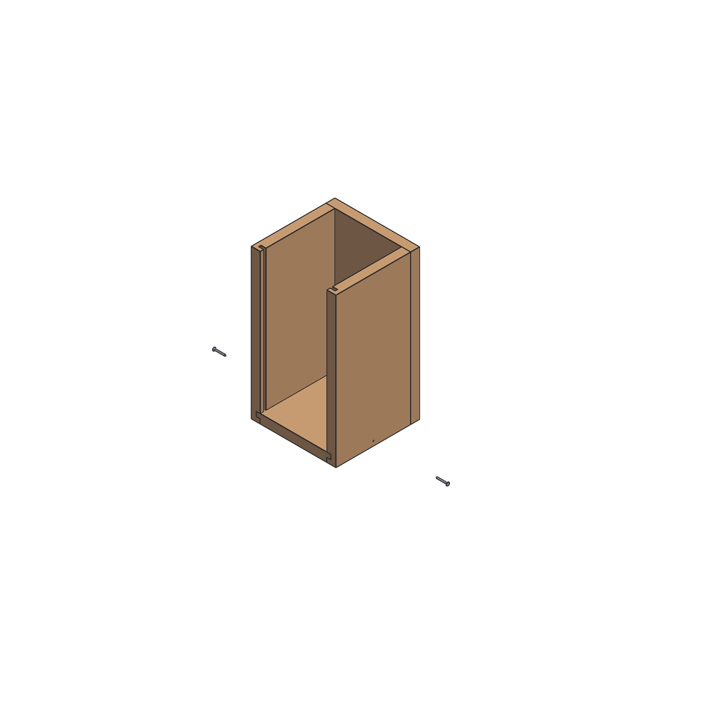
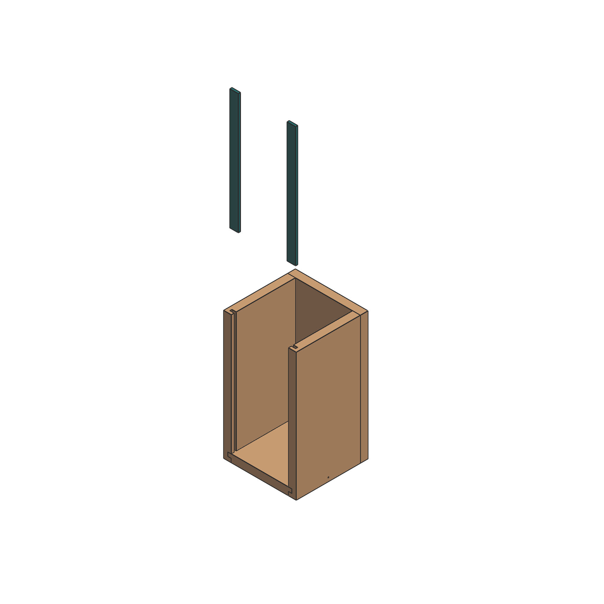
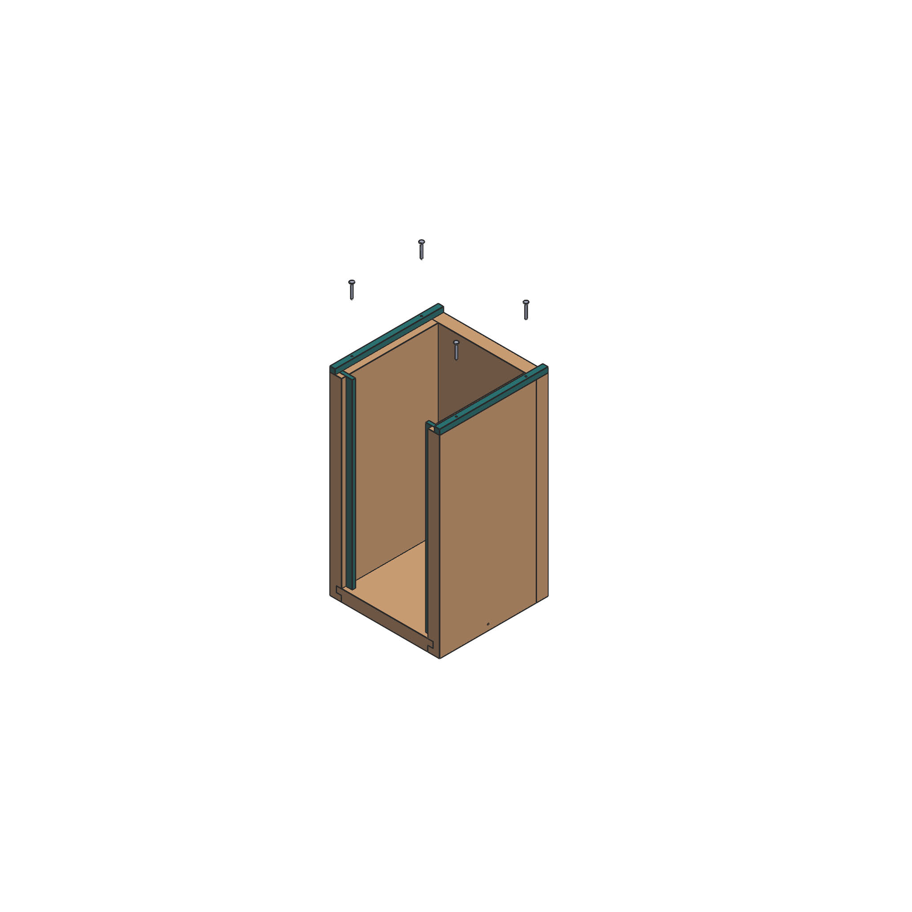
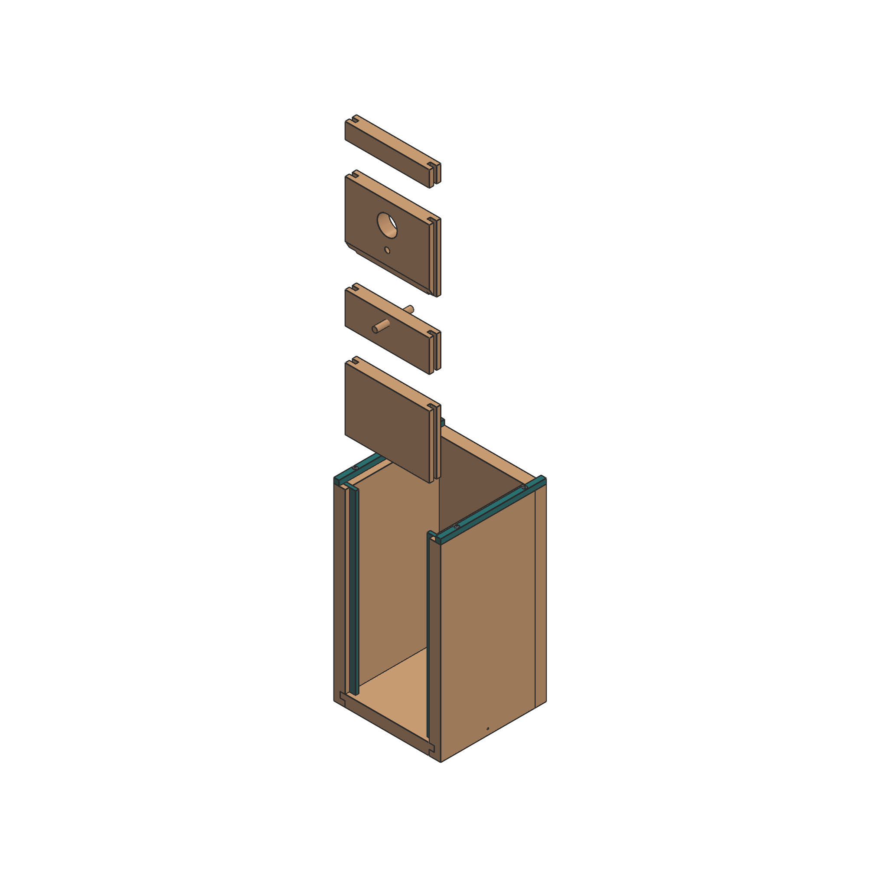
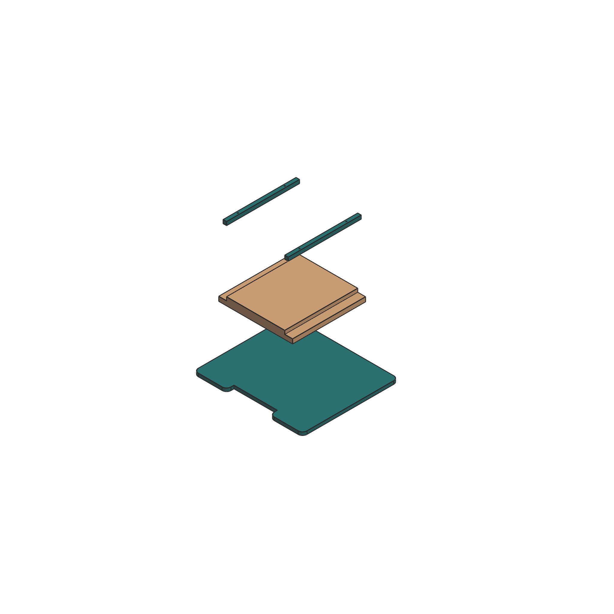
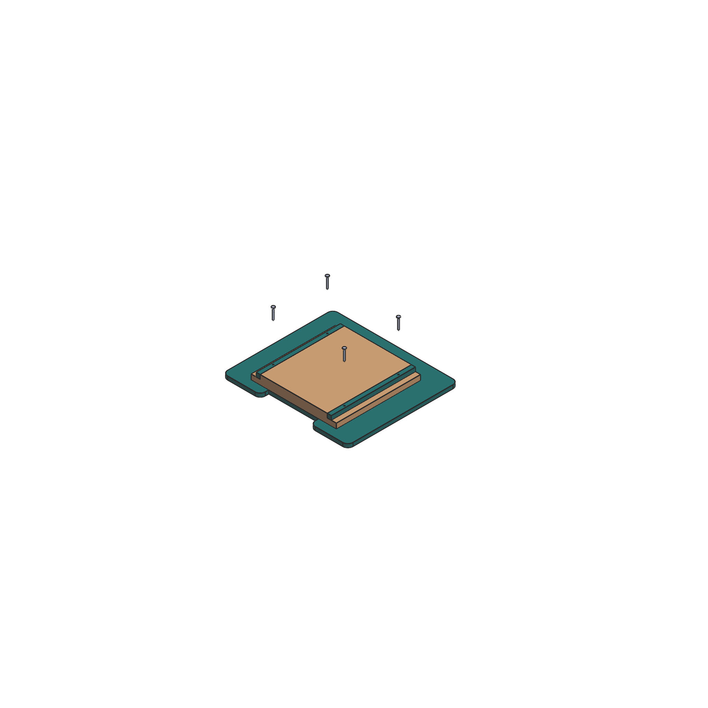

# Aufbauanleitung

Hier findet ihr die Bauanleitung von Vogelhaus "Ivonne". Achtet darauf, dass ihr alle entsprechenden Einzelteile im Voraus gefertigt habt, bevor ihr versucht die Teile zusammenzusetzen. Die Reihenfolge nach dem folgenden Prinzip ist bindend damit der Zusammenbau einfach und fehlerfrei abläuft. Bei diesem Beispiel werden 2 Baugruppen hergestellt, die schlussendlich zusammengesetzt werden. 

__Benötigte Werkzeuge und Hilfsstoffe für den Zusammenbau__

1. Schraubendreher oder Akkuschrauber
3. Schraubzwingen oder mindestens eine helfende Person
4. Schrauben: Für den Bau der Behausung M3 zwischen 12 und 40 mm (12 Stk.)
   und für die Montage Nägel oder Schrauben M3-M5 mit einer Mindestlänge von 80 mm (2 Stk.)
5. Schleifpapier (Körnung 80-200) oder Holzpfeilen für Korrekturen oder abschließende Schönheitsarbeiten.

__Baugruppe 1__ In Baugruppe 1 fertigst du den Hauptkörper des Vogelhauses. 
__Schritt 1__ Zu Beginn werden die hölzernen Seitenwände mit der Bodenplatte verbunden. Hierzu benötigst du 3 Schraueben der Größe M3/M4 mit einer Mindestlänge von 25 mm, also mindestens 7 mm länger als die Platte dick ist (18mm).
__Tipp:__ Benutze einen Schraubstock, Schraubzwingen oder lasse dir beim Zsammenbau helfen, damit die Kanten der Bauteile bündig und rechtwinklig zueinander stehen, wenn du die Schrauben eindrehst. 

__Schritt 2__ Die Bodenplatte lässt sich nun von vorne in die Baugruppe einschieben. Benutze hierfür gegebenenfalls zusätzlich Schrauben, (M3/M4, Mindestlänge 25 mm) um die Bodenplatte zu fixieren, wie im folgenden dargestellt:

__Schritt 3__ Anschließend werden die länglichen Kunststoffstreifen (282/20/5 mm) von oben in die Nuten der Seitenwände geschoben. Achte darauf, dass diese richtig einrasten und nicht überstehen. 

__Schritt 4__ Jetzt kannst du 2 der dünnen Kunstoffstreifen (168/8/8 mm) mit jeweils 2 Schrauben der Größe M3, Länge zwischen 12 und 25 mm befestigen. 

__Schritt 5__ Nun schiebe die Teilstücke der Frontwand in die entstandene Halterung. Achte auch hier darauf, dass kein Teil übersteht, aber auch keine größeren Lücken entstehen.

__Baugruppe 2__ In Baugruppe 2 fertigst du das Dach des Hauses. 
__Schritt 6__ Lege die innere Dachplatte aus Holz auf die äußere Dachplatte aus Kunststoff. Auf die eingefrästen Ränder der Holzplatte lege anschließend die verbleibenden 2 Kunststoffstreifen (168/8/8). Hierfür nutze ebenfalls jeweils 2 Schrauben der Größe M3, Länge zwischen 12 und 25 mm

__Zusamnenfügen der Baugruppen 1 und 2__ 
__Schritt 7__ Du kannst nun folgendermaßen das Dach auf den Hauptkörper setzen. Achte darauf, dass die eingefräste Kante des Daches und die Rückwand eine vertikale Linie bilden, damit sich das Kunststoffbrett zur Montage abstandslos befestigen lässt. 

__Schritt 8__ Schraube nun mit 2 M3 Schrauben des Länge 25-28 mm das hintere Brett aus Kunststoff fest. Achte daruaf, dass die Nägel nicht kürzer oder länger als angegeben sind, damit die Konstruktion fest genug hält, die Nägel aber nicht ins Innere der Behausung durchragen. 

Dein Vogelhaus ist nun __fertig__ aufgebaut.

__Montage__ Jetzt geht es nur noch um die richtige Befestigung beim Aufhängen an einem geeigneten Baum oder bspw. einer Hauswand. Benutze - solltest du dich für einen Baum entscheiden-  wenn möglich Aluminiumnägel mit einer Länge von mindestens 80 mm. Nägel aus Eisen sind aber auch in Ordnung. 

