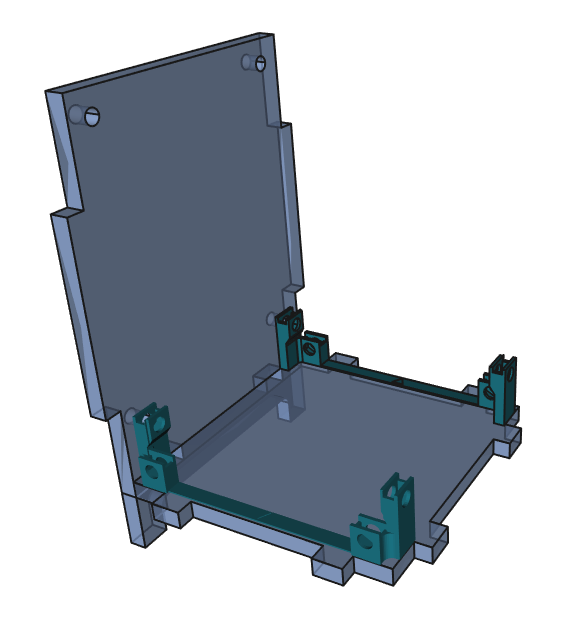

# Vogelhaus 1 (Name ggf. ändern) Bauanleitung

# Beschreibung
(Einleitungstext)

(Vorlagen für weitere Bearbeitung, kann später gelöscht werden):

Liste mit Stichpunkten:
- Punkt 1
- Punkt 2
  - Unterpunkt 2.1 (zwei Leerzeichen vor dem Spiegelstrich "-" hinzufügen)
  - Unterpunkt 2.2
- Punkt 3

Normaler Text **fettgedruckt** , _kursiv_ 

Bild:

Die Datei "Beispielbild.png" muss im Ordner "Documentation" liegen (über "Upload file")

## Material- und Werkzeugliste

(Hier benötigte Materialien und Werkzeuge auflisten)

## Bauanleitung

(hier Bauanleitung beschreiben)
